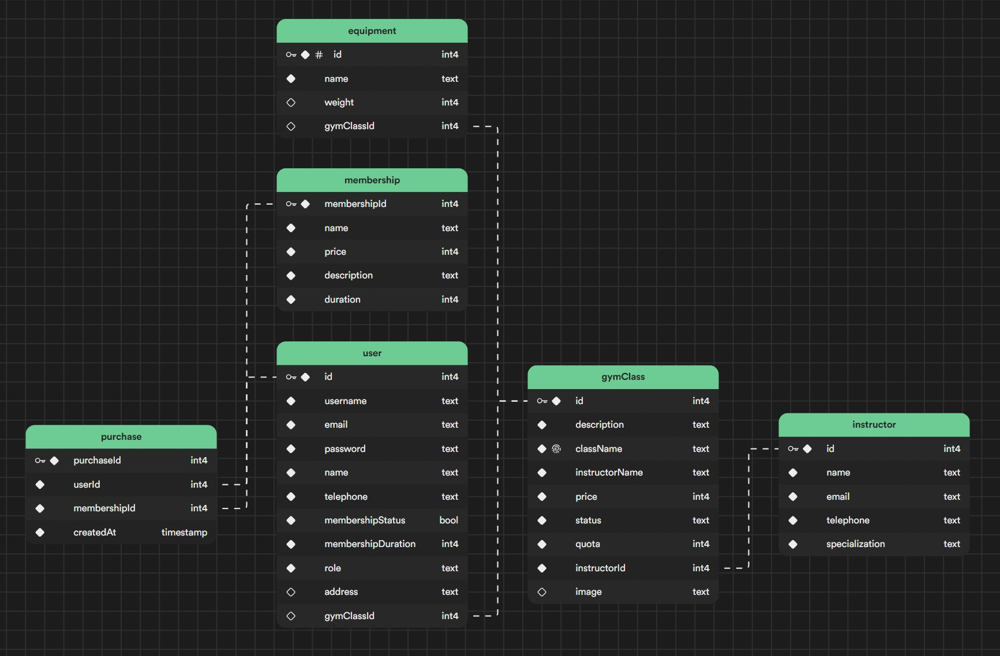

# Gym Master

## Deskripsi Singkat
GymMaster merupakan perangkat lunak yang berfungsi untuk membantu proses manajemen gym. GymMaster dapat digunakan oleh admin dan _customer_.  GymMaster memfasilitasi usernya untuk melakukan _register_ dan _login_, dari sisi admin, Ia dapat membuka kelas, mengatur jadwal, harga kelas, dan _membership_, mengelola fasilitas gym, dan berkomunikasi dengan _customer_. Dari sisi customer, mereka dapat melihat kelas, memesan kelas, melihat jadwal kelas, dan berkomunikasi dengan _instructor_ atau admin. 

Sistem diharapkan dapat menjadi **_one-stop solution_** bagi pengguna sebagai pelanggan gym serta menjadi alat bantu manajemen seluruh aspek operasional maupun non operasional gym bagi pengelola gym (admin).

## Cara Menjalankan Aplikasi
Pertama, lakukan _clone_ dengan perintah:
```bash
git clone https://gitlab.informatika.org/tubes-rpl-g10/gymmaster.git
```
Unduh versi LTS NodeJS melalui utas [https://nodejs.org/en/](https://nodejs.org/en/), lakukan instalasi, lalu buka _command prompt_ dan berpindahlah ke berkas _repository_ dengan:
```bash
cd gymmaster
``` 
Unduh semua dependensi yang ada dengan perintah:
```bash
npm install
```
Lalu, jalankan perintah berikut:
```bash
npm run dev
````

Buka alamat [http://localhost:3000](http://localhost:3000) dengan aplikasi peramban Anda dan mulailah mencoba fitur Gym Master.

Anda dapat mengubah aplikasi Gym Master dengan membuka berkas `app` lalu mengubah komponen (di berkas `/components`) maupun API (di folder `/api`)

## _Tech Stack_

Program ini ditulis dengan `NextJS` yang merupakan sebuah _full-stack framework_ yang dibangun di atas NodeJS dan ReactJS. Hal ini juga membuat GymMaster memiliki arsitektur monolitik. Proses styling dilakukan dengan `Tailwind CSS` dan pustaka komponen DaisyUI.

Proses penyimpanan data menggunakan DBMS `PostgreSQL` yang di-host oleh Supabase. Bagian _back-end_ berinteraksi dengan basis data menggunakan object-relational-mapper (ORM) bernama `Prisma`. Proses autentikasi ditangani oleh pustaka NextJS bernama Next-Auth.

Proses testing dilakukan dengan pustaka bernama `Jest` dan `React Testing Library`.

## Daftar _Use Case_ yang Diimplementasi

| Kode UC | Nama UC | Deskripsi | NIM PIC | Nama PIC |
| ------ | ------ |------- | ------ | ------ | 
| UC01   |  Mendaftar akun      | _Use case_ ini memungkinkan pengguna untuk mendaftar akun baru di sistem GymMaster. | 18221130 | Rayhan Maheswara Pramanda 
| UC02   |    Melakukan login    | _Use case_ ini memungkinkan pengguna dan admin untuk melakukan proses _login_ ke akun mereka.    | 18221130       | Rayhan Maheswara Pramanda       |        |
| UC03   |      Melakukan logout  | _Use case_ ini memungkinkan pengguna dan admin untuk melakukan proses _logout_ dari akun mereka.    |  18221130      | Rayhan Maheswara Pramanda       |
| UC05   |     Melihat detil akun | _Use case_ ini memungkinkan pengguna dan admin untuk melihat detail akun pengguna. | 18221090 | Marcheline Fanni Putri Hidayat
| UC06   |    Melihat daftar akun    | _Use case_ ini memungkinkan admin untuk melihat daftar anggota dan rincian informasi seperti status _membership_, nama, alamat, nomor kontak, dan riwayat pembayaran. Pengguna dapat melihat rincian informasi pribadi mereka.    |  18221090      | Marcheline Fanni Putri Hidayat       |        |
| UC07   |     Melihat daftar kelas   | _Use case_ ini memungkinkan pengguna (baik _member_ atau non-_member_) dan admin untuk melihat daftar kelas yang tersedia di gym beserta informasi seperti nama kelas, instruktur, dan jadwal.    |  18221124      | Jazmy Izzati Alamsyah
| UC08   |   Mendaftar pada suatu kelas | _Use case_ ini memungkinkan pengguna untuk mendaftar pada kelas tertentu yang tersedia, baik yang memerlukan pembayaran tambahan maupun yang sudah termasuk dalam _membership_.    |  18221124      | Jazmy Izzati Alamsyah       |        |
| UC09   |Mencari suatu kelas        | _Use case_ ini memungkinkan pengguna dan admin untuk mencari kelas berdasarkan kriteria seperti jenis olahraga, instruktur, atau jadwal.    | 18221124       | Jazmy Izzati Alamsyah       |        |
| UC10   |Menambah kelas        | _Use case_ ini memungkinkan admin untuk menambahkan kelas baru dengan mengisi detail seperti kapasitas, instruktur, dan tipe olahraga.    | 18221124       | Jazmy Izzati Alamsyah       |        |
| UC11   |Menghapus kelas        | _Use case_ ini memungkinkan admin untuk menghapus kelas yang sudah ada.    | 18221124, 18221130       | Jazmy Izzati Alamsyah, Rayhan Maheswara Pramanda       |        |
| UC13   |Membeli membership        |_Use case_ ini memungkinkan pengguna untuk membeli _membership_ dengan memilih masa berlaku _membership_ dan melakukan pembayaran sesuai dengan harga yang ditentukan.     | 18221172       | Aditya Inas Hamidah       |        |
| UC14   |Memperbarui membership        |_Use case_ ini memungkinkan pengguna untuk memperbarui _membership_ mereka, misalnya dengan memperpanjang masa berlaku.     | 18221130, 18221172       | Rayhan Maheswara Pramanda, Aditya Inas Hamidah       |        |
| UC15   |  Melakukan pembayaran| Use case ini memungkinkan pengguna untuk melakukan pembayaran, baik untuk mendaftar pada kelas tertentu maupun untuk pembelian _membership_.     | 1822172       | Aditya Inas Hamidah       |        |

## Daftar Tabel Basis Data Implementasi


_Dikembangkan sebagai pemenuhan Tugas Besar IF3152 Rekayasa Perangkat Lunak STI 2023/2024._

